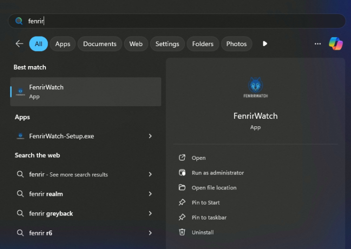
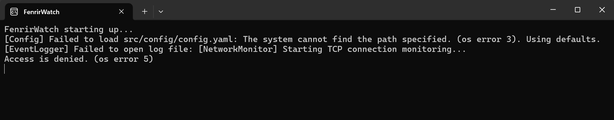
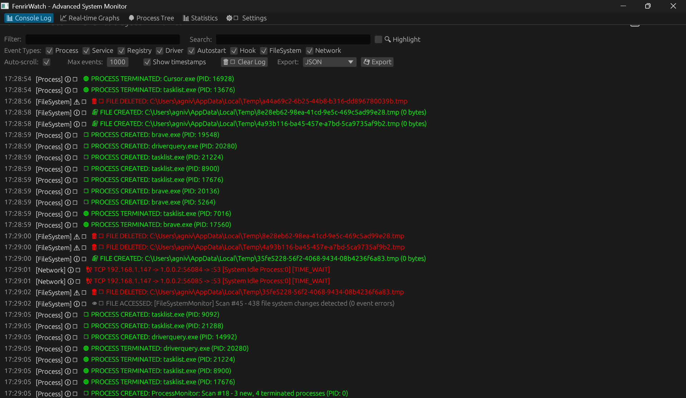
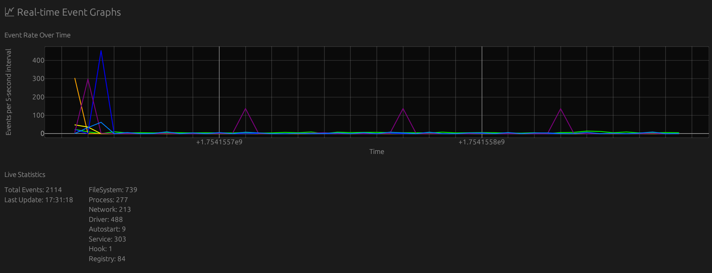
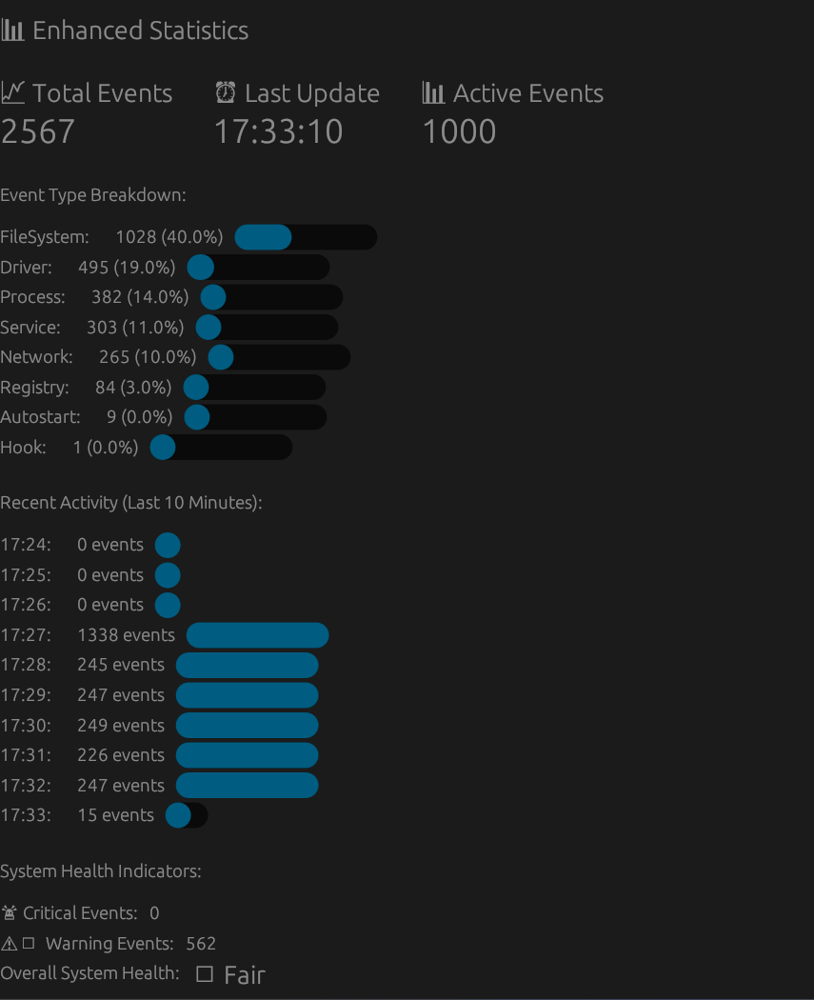

# FenrirWatch

FenrirWatch is a comprehensive Windows system monitoring application written in Rust that provides real-time surveillance of critical system components for security analysis and threat detection.

## Features

### **Real-time Monitoring**

- **Process Monitoring**: Tracks process creation/termination using tasklist fallback
- **Registry Monitoring**: Monitors critical registry keys for unauthorized changes
- **Service Monitoring**: Tracks Windows service state changes
- **Driver Monitoring**: Monitors kernel driver loading/unloading events
- **Autostart Monitoring**: Detects persistence mechanisms in startup locations
- **Hook Detection**: Placeholder for future API hook detection

### **Advanced GUI Interface**

- **Real-time Console**: Live event streaming with filtering and search
- **Event Type Filtering**: Focus on specific event types
- **Dark/Light Mode**: Configurable theme support
- **Process Tree Visualization**: Hierarchical process relationship display
- **Statistics Dashboard**: Event analytics and system health indicators
- **Export Capabilities**: JSON, CSV, and TXT export formats

### **Security Features**

- **Rate Limiting**: Prevents event spam and reduces noise
- **Log Rotation**: Automatic log file management (10MB limit)
- **Error Handling**: Graceful degradation for monitoring failures
- **Configurable Monitoring**: YAML-based configuration system

## Technical Stack

- **Language**: Rust 2021 Edition
- **GUI Framework**: egui with eframe
- **Windows APIs**: Windows-rs for native system access
- **Serialization**: Serde with JSON/YAML support
- **Concurrency**: Crossbeam channels for thread communication
- **Time Handling**: Chrono for timestamp management

## Quick Start

### Prerequisites

- Windows 10/11
- Rust toolchain (latest stable) if building from IDE
- Administrator privilege (to install from BIN installer)

Step 1: Download and install the latest version through the releases tab in the repository. The installation assistant will have everything you should need. If you need more help, the release tab is tailored specifically to the version release.

Step 2: Launch the application, via the search bar on Windows (shown below), desktop shortcut installed, or whatever other way you want.


If you do not launch the app as admin, it will encounter the inability to access critical system information and write logs. YOU MUST RUN AS ADMINISTRATOR!

Below is an example of something you may see if you do not launch as an administrator.



Once you launch as administrator, you'll see the primary GUI.



This is where all the fun happens. You can see all the logs being written in the main GUI tab and also select specific information you do (not?) want. You can also save your specific configuration via the save button and it will save what you want for next startup.

There's also a real-time event graph:



Which you can also interact with as you please (zoom, adjust timeline, etc).

There's also an enhanced statistics page which shows what's generally happening.



### Configuration

The application uses `src/config/config.yaml` for configuration. Key settings include:
- `dark_mode`: Enable dark theme
- `max_events`: Maximum events to display in GUI
- `selected_event_types`: Filter specific event types
- `log_path`: Log file location
- `graph_max_points`: Number of data points for graphs

## Monitoring Capabilities

### **Process Monitoring**

- Tracks process creation and termination
- Maintains process cache for GUI display
- Rate limiting prevents spam events
- Fallback to tasklist command (ETW planned)

### **Registry Monitoring**

- Critical security keys monitoring:
  - `HKLM/SOFTWARE/Microsoft/Windows/CurrentVersion/Run`
  - `HKLM/SOFTWARE/Microsoft/Windows/CurrentVersion/RunOnce`
  - `HKCU/SOFTWARE/Microsoft/Windows/CurrentVersion/Run`
  - `HKLM/SYSTEM/CurrentControlSet/Services`
- Real-time change detection
- Rate limiting for change events

### **Service Monitoring**

- Windows service state tracking
- Service modification detection
- Uses `sc query` command for monitoring

### **Driver Monitoring**

- Kernel driver loading/unloading events
- Rootkit detection capabilities
- Uses `driverquery` command for monitoring

### **Autostart Monitoring**

- Registry autostart locations
- Startup folder scanning
- Persistence mechanism detection

## 🔧 Development

### Project Structure

```
fenrirwatch/
├── src/
│   ├── main.rs          # Application entry point
│   ├── core/mod.rs      # Core monitoring logic
│   ├── gui/mod.rs       # GUI implementation
│   └── config/          # Configuration management
├── Cargo.toml           # Dependencies and metadata
├── config.yaml          # Default configuration
└── icon.png            # Application icon
```

### Building

```bash
# Development build
cargo build

# Release build
cargo build --release

# Run tests
cargo test

# Check for warnings
cargo check
```

## Logging

The application generates detailed logs in JSON format:

- **Location**: `fenrirwatch.log` (configurable)
- **Format**: JSON with timestamps and event details
- **Rotation**: Automatic at 10MB with backup creation
- **Rate Limiting**: Prevents repetitive log entries

## Contributing

1. Fork the repository
2. Create a feature branch
3. Make your changes
4. Add tests if applicable
5. Submit a pull request

## License

This project is licensed under the MIT License - see the [LICENSE](LICENSE) file for details.

## Disclaimer

This tool is designed for security analysis and system monitoring. Use responsibly and in accordance with applicable laws and regulations. I'm not responsible for any mishandling

---
